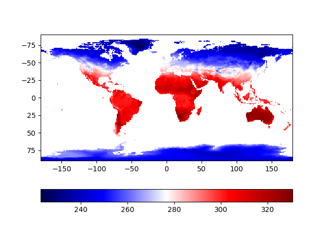
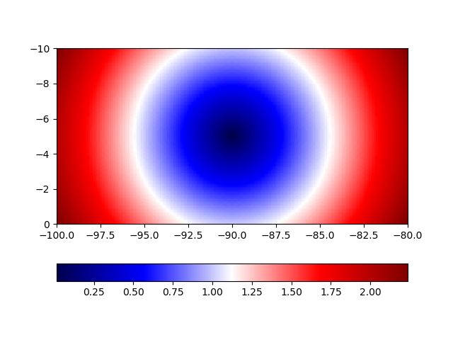

Gkit
--------

.. image:: https://img.shields.io/github/license/TitorX/gkit.svg
    :alt: GitHub license
    :target: https://github.com/TitorX/gkit/blob/master/LICENSE

.. image:: https://img.shields.io/badge/python-3-brightgreen.svg
    :target: https://www.python.org

Gkit is a suit of utilites for processing geo-dataset.

Until now, it's only support to manipulate GeoTIFF dataset and a part of 
interaction between raster and vector dataset.

Gkit supports Python3 and all OS which could install numpy, matplotlib, 
gdal.

In Python2, may have unpredictable bugs.

Documents: https://titorx.github.io/gkit/html/

Simple Example
---------------

Here is examples of some basic features that Gkit provides.

.. code-block:: python

    import numpy as np
    import gkit as gk

    # Read the first layer(band) from .tif.
    r = gk.read_geotiff("lst.tif")

    # You could also specific point out which layer(band) you want to load.
    r = gk.read_geotiff("lst.tif", 2)

    # gk.read_geotiff return a Raster class
    type(r)
    # Output:
    # gkit.core.Raster

    # Open an interactive window display raster using matplotlib(call plt.show).
    r.show()

The picture:

.. code-block:: python

    # Only draw raster without calling plt.show to continue
    # modify figure.
    import matplotlib.pylab as plt
    r.plot()
    plt.xlabel("Lon")
    plt.ylabel("Lat")
    plt.title("LST(C)")
    plt.savefig("lst_plot.png")

    # Raster class inherits from np.ma.MaskedArray.
    # It has all features which MaskedArray has.
    r
    # Output:
    # masked_array(data =
    #  [[-- -- -- ..., -- -- --]
    #  [-- -- -- ..., -- -- --]
    #  [-- -- -- ..., -- -- --]
    #  ...,
    #  [242.5966339111328 242.6825408935547 242.79612731933594 ...,
    #   243.512451171875 243.46498107910156 243.45751953125]
    #  [241.1952667236328 241.18592834472656 241.19235229492188 ...,
    #   241.02757263183594 241.04196166992188 241.0919189453125]
    #  [241.97023010253906 242.03948974609375 242.05393981933594 ...,
    #   241.8543243408203 241.85800170898438 241.80813598632812]],
    #              mask =
    #  [[ True  True  True ...,  True  True  True]
    #  [ True  True  True ...,  True  True  True]
    #  [ True  True  True ...,  True  True  True]
    #  ...,
    #  [False False False ..., False False False]
    #  [False False False ..., False False False]
    #  [False False False ..., False False False]],
    #        fill_value = 1e+20)

    # Doing operation like common numpy masked array.
    tmp = (r - 273.15)**3 / 4
    tmp = np.cos(r)
    tmp = np.abs(r)
    tmp = np.sqrt(r)

    print(r.shape)
    print(r.mean())
    print(r.max())
    print(r.min())

    tmp = r.astype(np.float64)

    # Save to file
    r.save("out_file.tif")

    # Create a raster from numpy array
    import numpy as np
    x, y = np.mgrid[-1:1:100j, -2:2:200j]
    array = np.sqrt(x**2 + y**2)

    print(array.shape)
    # Output:
    # (100, 200)

    transform = [-100, 0.1, 0, 0, 0, -0.1]

    raster = gk.Raster(array, transform)
    raster.show()

The output picture:

